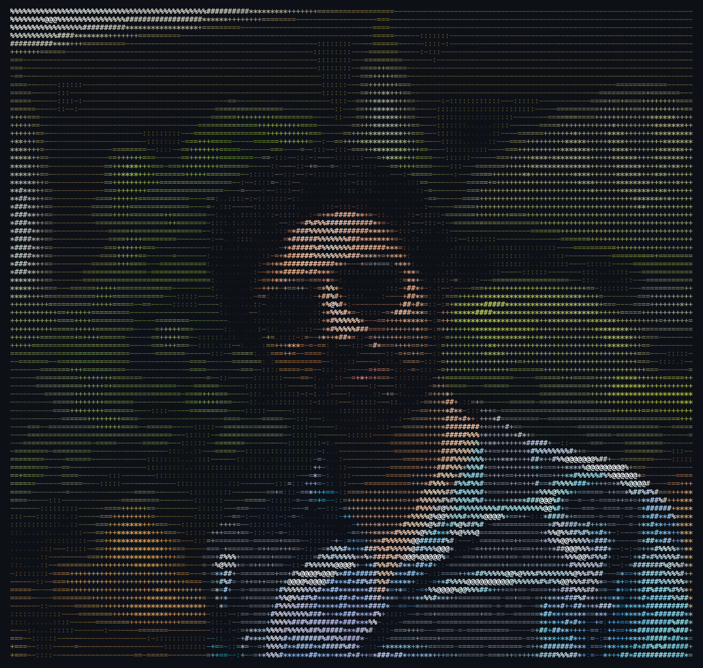

<table>
  <tr>
    <td width="50%" valign="top">
      <h3>┌─[ athreya@portfolio ]─[ ~/about ]</h3>
      
    </td>
    <td width="50%" valign="top">
      <h3>┌─[ athreya@portfolio ]─[ ~/profile ]</h3>
      <pre>╭─ identity
│ name     : Athreya Akondi
│ role     : Full Stack Developer
│ location : India
│ email    : akondiathreya@gmail.com
╰─ status   : open to opportunities

╭─ whoami
│ Engineering-focused developer building
│ scalable, user-centric systems.
╰─ domains
  full-stack · AI engineering · data engineering
  cloud engineering · distributed systems · FinTech

╭─ workspace
│ os        : macOS
│ ide       : Visual Studio Code
│ workflow  : learn · build · iterate
╰─ hobbies
  exploring the internet for new technology
  coding, building projects, and sharpening my skills
  developing deeper expertise in the tools I use

╭─ interests
│ competitive programming
│ AI Engineering
│ Cloud Infrastructure
│ Web3
╰─ education
  Artificial Intelligence and Machine Learning
  Aditya College of Engineering · 2022–2026

$ echo "always learning, always building"
always learning, always building</pre>
    </td>
  </tr>
</table>

---

<h1 align="center">Hi 👋, I'm Athreya</h1>
<h3 align="center">An engineering-focused Full Stack Developer from India</h3>

  

- 🌱 I'm a passionate full-stack developer skilled in **Designing, Developing, Testing**, and integrating **Generative AI** into real-world applications.  
  I specialize in architecting scalable, production-grade systems with a focus on building efficient, user-centric solutions across AI/ML, FinTech, and Cloud Engineering domains.

- ⚙️ I have hands-on experience with **DevOps practices** and **Deployment pipelines**, including containerization with **Docker** and automating deployment processes for highly scalable systems.

- 💡 My core strengths lie in **Full Stack Development** (MERN Stack, Next.js, React Native), **AI-driven applications** (LLMs, Computer Vision, NLP), **Data Engineering** (CDC, Log Aggregation, Stream Processing).
  I love transforming complex ideas into simple, elegant digital experiences while maintaining architectural excellence.

- 🚀 I'm always exploring cutting-edge technologies in **Generative AI**, **Machine Learning**, **Cloud Engineering**, and **Distributed Systems** to stay ahead of the curve and bring innovation to projects.

- 🎓 Completed my degree in **Artificial Intelligence and Machine Learning** at Aditya College of Engineering (2022-2026). Open to work and exciting opportunities!

- 📫 Feel free to reach out to me at **akondiathreya@gmail.com** — I'm always open to collaboration, learning, and building exciting projects together.

---

### Languages and Tools

<table>
  <!-- Programming -->
  <tr>
    <td style="vertical-align: middle; padding: 12px 16px; min-width: 180px; font-weight: 700;">
      💻 Programming
    </td>
    <td style="vertical-align: middle; padding: 12px 16px;">
      <a href="https://en.wikipedia.org/wiki/C_(programming_language)" target="_blank" rel="noreferrer" style="text-decoration: none; color: inherit; margin: 4px 8px; display: inline-block;">
        
        C
      </a>
      <a href="https://en.wikipedia.org/wiki/C%2B%2B" target="_blank" rel="noreferrer" style="text-decoration: none; color: inherit; margin: 4px 8px; display: inline-block;">
        
        C++
      </a>
      <a href="https://www.oracle.com/java/" target="_blank" rel="noreferrer" style="text-decoration: none; color: inherit; margin: 4px 8px; display: inline-block;">
        
        Java
      </a>
      <a href="https://www.python.org/" target="_blank" rel="noreferrer" style="text-decoration: none; color: inherit; margin: 4px 8px; display: inline-block;">
        
        Python
      </a>
      <a href="https://www.typescriptlang.org/" target="_blank" rel="noreferrer" style="text-decoration: none; color: inherit; margin: 4px 8px; display: inline-block;">
        
        TypeScript
      </a>
      <a href="https://developer.mozilla.org/en-US/docs/Web/JavaScript" target="_blank" rel="noreferrer" style="text-decoration: none; color: inherit; margin: 4px 8px; display: inline-block;">
        
        JavaScript
      </a>
    </td>
  </tr>

  <!-- Frontend / UI -->
  <tr>
    <td style="vertical-align: middle; padding: 12px 16px; font-weight: 700;">
      🎨 Frontend / UI
    </td>
    <td style="vertical-align: middle; padding: 12px 16px;">
      <a href="https://developer.mozilla.org/en-US/docs/Web/HTML" target="_blank" rel="noreferrer" style="text-decoration: none; color: inherit; margin: 4px 8px; display: inline-block;">
        
        HTML5
      </a>
      <a href="https://developer.mozilla.org/en-US/docs/Web/CSS" target="_blank" rel="noreferrer" style="text-decoration: none; color: inherit; margin: 4px 8px; display: inline-block;">
        
        CSS3
      </a>
      <a href="https://react.dev/" target="_blank" rel="noreferrer" style="text-decoration: none; color: inherit; margin: 4px 8px; display: inline-block;">
        
        React
      </a>
      <a href="https://reactnative.dev/" target="_blank" rel="noreferrer" style="text-decoration: none; color: inherit; margin: 4px 8px; display: inline-block;">
        
        React Native
      </a>
      <a href="https://getbootstrap.com/" target="_blank" rel="noreferrer" style="text-decoration: none; color: inherit; margin: 4px 8px; display: inline-block;">
        
        Bootstrap
      </a>
      <a href="https://tailwindcss.com/" target="_blank" rel="noreferrer" style="text-decoration: none; color: inherit; margin: 4px 8px; display: inline-block;">
        
        Tailwind CSS
      </a>
      <a href="https://vite.dev/" target="_blank" rel="noreferrer" style="text-decoration: none; color: inherit; margin: 4px 8px; display: inline-block;">
        
        Vite
      </a>
      <a href="https://mui.com/" target="_blank" rel="noreferrer" style="text-decoration: none; color: inherit; margin: 4px 8px; display: inline-block;">
        
        Material UI
      </a>
      <a href="https://figma.com/" target="_blank" rel="noreferrer" style="text-decoration: none; color: inherit; margin: 4px 8px; display: inline-block;">
        
        Figma
      </a>
      <a href="https://nextjs.org/" target="_blank" rel="noreferrer" style="text-decoration: none; color: inherit; margin: 4px 8px; display: inline-block;">
        
        Next.js
      </a>
    </td>
  </tr>

  <!-- Backend / APIs -->
  <tr>
    <td style="vertical-align: middle; padding: 12px 16px; font-weight: 700;">
      ⚙️ Backend / APIs
    </td>
    <td style="vertical-align: middle; padding: 12px 16px;">
      <a href="https://nodejs.org/" target="_blank" rel="noreferrer" style="text-decoration: none; color: inherit; margin: 4px 8px; display: inline-block;">
        
        Node.js
      </a>
      <a href="https://expressjs.com/" target="_blank" rel="noreferrer" style="text-decoration: none; color: inherit; margin: 4px 8px; display: inline-block;">
        
        Express
      </a>
      <a href="https://fastapi.tiangolo.com/" target="_blank" rel="noreferrer" style="text-decoration: none; color: inherit; margin: 4px 8px; display: inline-block;">
        
        FastAPI
      </a>
      <a href="https://spring.io/projects/spring-boot" target="_blank" rel="noreferrer" style="text-decoration: none; color: inherit; margin: 4px 8px; display: inline-block;">
        
        Spring Boot
      </a>
      <a href="https://www.npmjs.com/" target="_blank" rel="noreferrer" style="text-decoration: none; color: inherit; margin: 4px 8px; display: inline-block;">
        
        npm
      </a>
    </td>
  </tr>

  <!-- Databases & Infrastructure -->
  <tr>
    <td style="vertical-align: middle; padding: 12px 16px; font-weight: 700;">
      🗄️ Databases & Infra
    </td>
    <td style="vertical-align: middle; padding: 12px 16px;">
      <a href="https://www.mongodb.com/" target="_blank" rel="noreferrer" style="text-decoration: none; color: inherit; margin: 4px 8px; display: inline-block;">
        
        MongoDB
      </a>
      <a href="https://www.mysql.com/" target="_blank" rel="noreferrer" style="text-decoration: none; color: inherit; margin: 4px 8px; display: inline-block;">
        
        MySQL
      </a>
      <a href="https://www.postgresql.org/" target="_blank" rel="noreferrer" style="text-decoration: none; color: inherit; margin: 4px 8px; display: inline-block;">
        
        PostgreSQL
      </a>
      <a href="https://redis.io/" target="_blank" rel="noreferrer" style="text-decoration: none; color: inherit; margin: 4px 8px; display: inline-block;">
        
        Redis
      </a>
    </td>
  </tr>

  <!-- Data Engineering & Streaming -->
  <tr>
    <td style="vertical-align: middle; padding: 12px 16px; font-weight: 700;">
      📊 Data Engineering
    </td>
    <td style="vertical-align: middle; padding: 12px 16px;">
      <a href="https://kafka.apache.org/" target="_blank" rel="noreferrer" style="text-decoration: none; color: inherit; margin: 4px 8px; display: inline-block;">
        
        Apache Kafka
      </a>
    </td>
  </tr>

  <!-- AI / ML / Data -->
  <tr>
    <td style="vertical-align: middle; padding: 12px 16px; font-weight: 700;">
      🧠 AI Engineering
    </td>
    <td style="vertical-align: middle; padding: 12px 16px;">
      <a href="https://huggingface.co/" target="_blank" rel="noreferrer" style="text-decoration: none; color: inherit; margin: 4px 8px; display: inline-block;">
        
        Hugging Face
      </a>
      <a href="https://www.langchain.com/" target="_blank" rel="noreferrer" style="text-decoration: none; color: inherit; margin: 4px 8px; display: inline-block;">
        LangChain
      </a>
      <a href="https://langchain-ai.github.io/langgraph/" target="_blank" rel="noreferrer" style="text-decoration: none; color: inherit; margin: 4px 8px; display: inline-block;">
        LangGraph
      </a>
      RAG
    </td>
  </tr>

  <!-- DevOps & Observability -->
  <tr>
    <td style="vertical-align: middle; padding: 12px 16px; font-weight: 700;">🚀 DevOps</td>
    <td style="vertical-align: middle; padding: 12px 16px;">
      <a href="https://www.docker.com/" target="_blank" rel="noreferrer" style="text-decoration: none; color: inherit; margin: 4px 8px; display: inline-block;">Docker</a>
      <a href="https://opentelemetry.io/" target="_blank" rel="noreferrer" style="text-decoration: none; color: inherit; margin: 4px 8px; display: inline-block;">OpenTelemetry</a>
    </td>
  </tr>
  <tr>
    <td style="vertical-align: middle; padding: 12px 16px; font-weight: 700;">📈 Observability</td>
    <td style="vertical-align: middle; padding: 12px 16px;">
      <a href="https://prometheus.io/" target="_blank" rel="noreferrer" style="text-decoration: none; color: inherit; margin: 4px 8px; display: inline-block;">Prometheus</a>
      <a href="https://grafana.com/" target="_blank" rel="noreferrer" style="text-decoration: none; color: inherit; margin: 4px 8px; display: inline-block;">Grafana</a>
    </td>
  </tr>

  <!-- Tools & Editors -->
  <tr>
    <td style="vertical-align: middle; padding: 12px 16px; font-weight: 700;">
      🛠️ Tools & Editors
    </td>
    <td style="vertical-align: middle; padding: 12px 16px;">
      <a href="https://git-scm.com/" target="_blank" rel="noreferrer" style="text-decoration: none; color: inherit; margin: 4px 8px; display: inline-block;">
        
        Git
      </a>
      <a href="https://github.com/" target="_blank" rel="noreferrer" style="text-decoration: none; color: inherit; margin: 4px 8px; display: inline-block;">
        
        GitHub
      </a>
      <a href="https://www.postman.com/" target="_blank" rel="noreferrer" style="text-decoration: none; color: inherit; margin: 4px 8px; display: inline-block;">
        
        Postman
      </a>
      <a href="https://code.visualstudio.com/" target="_blank" rel="noreferrer" style="text-decoration: none; color: inherit; margin: 4px 8px; display: inline-block;">
        
        VS Code
      </a>
    </td>
  </tr>

  <!-- Coding Platforms -->
  <tr>
    <td style="vertical-align: middle; padding: 12px 16px; font-weight: 700;">
      🏆 Coding Platforms
    </td>
    <td style="vertical-align: middle; padding: 12px 16px;">
      <a href="https://leetcode.com/u/athreya_akondi/" target="_blank" rel="noreferrer" style="text-decoration: none; color: inherit; margin: 4px 8px; display: inline-block;">
        
        LeetCode
      </a>
      <a href="https://www.codechef.com/users/akondi_athreya" target="_blank" rel="noreferrer" style="text-decoration: none; color: inherit; margin: 4px 8px; display: inline-block;">
        
        CodeChef
      </a>
      <a href="https://codeforces.com/profile/Athreya_Akondi" target="_blank" rel="noreferrer" style="text-decoration: none; color: inherit; margin: 4px 8px; display: inline-block;">
        
        Codeforces
      </a>
      <a href="https://www.hackerrank.com/profile/akondi_athreya" target="_blank" rel="noreferrer" style="text-decoration: none; color: inherit; margin: 4px 8px; display: inline-block;">
        
        HackerRank
      </a>
      <a href="https://www.geeksforgeeks.org/user/akondi_athreya/" target="_blank" rel="noreferrer" style="text-decoration: none; color: inherit; margin: 4px 8px; display: inline-block;">
        
        GeeksforGeeks
      </a>
    </td>
  </tr>

  <!-- Socials -->
  <tr>
    <td style="vertical-align: middle; padding: 12px 16px; font-weight: 700;">
      🤝 Socials & Connect
    </td>
    <td style="vertical-align: middle; padding: 12px 16px;">
      <a href="https://github.com/akondi-athreya" target="_blank" rel="noreferrer" style="text-decoration: none; color: inherit; margin: 4px 8px; display: inline-block;">
        
        GitHub
      </a>
      <a href="https://linkedin.com/in/athreya-akondi" target="_blank" rel="noreferrer" style="text-decoration: none; color: inherit; margin: 4px 8px; display: inline-block;">
        
        LinkedIn
      </a>
      <a href="https://www.instagram.com/surpass_u_/" target="_blank" rel="noreferrer" style="text-decoration: none; color: inherit; margin: 4px 8px; display: inline-block;">
        
        Instagram
      </a>
      <a href="mailto:akondiathreya@gmail.com" target="_blank" rel="noreferrer" style="text-decoration: none; color: inherit; margin: 4px 8px; display: inline-block;">
        
        Gmail
      </a>
      <a href="https://athreya.vercel.app/" target="_blank" rel="noreferrer" style="text-decoration: none; color: inherit; margin: 4px 8px; display: inline-block;">
        
        Portfolio
      </a>
    </td>
  </tr>
</table>

---

### 🎯 Key Expertise Areas

- **Full Stack Development**: React, Next.js, React Native | Node.js, Express, FastAPI, Spring Boot
- **AI Engineering**: LLM Prompt Routing, BERT-based models, NLP, Ollama, LangChain, LangGraph, RAG
- **Data Engineering**: Apache Kafka, CDC, Stream Processing
- **Databases**: MongoDB, PostgreSQL, Redis
- **System Design**: CQRS, Repository Pattern, Multi-Tenancy, Circuit Breakers, Bulkhead Pattern
- **DevOps & Observability**: Docker, OpenTelemetry, Prometheus, Grafana

---

<!-- SUMMARY + LANGUAGES (WORKING) -->
<!-- 

  
  

 -->

<!--   -->

<!-- FOLLOWERS + STARS BADGES (WORKING) -->
<!-- 

  
  

 -->

<!--   -->

<!-- STREAK (WORKING AND UNCHANGED) -->
<!-- 

  

 -->
